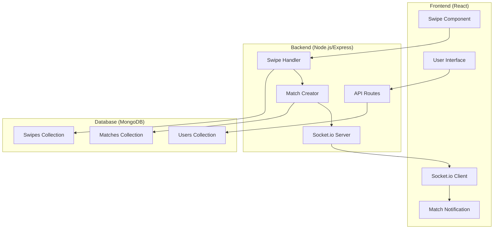

# Tài Liệu Thiết Kế - Dating App

## Tổng Quan

Dating App đơn giản tập trung vào luồng chính: hiển thị users → swipe → real-time notification → update database → hiển thị frontend. Hệ thống sử dụng Node.js/Express cho backend, React cho frontend, MongoDB cho database, và Socket.io cho real-time communication.

## Kiến Trúc Hệ Thống



## Thành Phần và Giao Diện

### 1. Frontend Components (React)

#### SwipeCard Component
```javascript
// Component hiển thị thông tin user để swipe
const SwipeCard = ({ user, onSwipe }) => {
  // Hiển thị userId, name
  // Xử lý swipe gestures
  // Gọi onSwipe callback với action (like/pass)
}
```

#### MatchNotification Component  
```javascript
// Component hiển thị thông báo match real-time
const MatchNotification = ({ match, onClose }) => {
  // Hiển thị thông báo "It's a Match!"
  // Hiển thị thông tin 2 users trong match
  // Auto-hide sau 3 giây
}
```

#### MatchList Component
```javascript
// Component hiển thị danh sách matches
const MatchList = ({ matches }) => {
  // Hiển thị danh sách tất cả matches
  // Mỗi match hiển thị thông tin user kia
}
```

### 2. Backend API Routes (Express.js)

#### User Routes
```javascript
// GET /api/users/available/:userId - Lấy users available để swipe
// Loại trừ user hiện tại và users đã swipe
```

#### Swipe Routes  
```javascript
// POST /api/swipes - Tạo swipe action mới
// Body: { fromUserId, toUserId, type }
// Xử lý logic tạo match nếu có mutual like
```

#### Match Routes
```javascript
// GET /api/matches/:userId - Lấy danh sách matches của user
```

### 3. Socket.io Events

#### Client Events
```javascript
// 'join-room' - User join room với userId
// 'disconnect' - User disconnect
```

#### Server Events
```javascript
// 'new-match' - Emit khi có match mới
// 'user-online' - Emit khi user online/offline
```

## Mô Hình Dữ Liệu

### Users Collection
```javascript
{
  _id: ObjectId,
  userId: String,    // "user1", "user2", etc.
  name: String,      // Tên hiển thị
  isOnline: Boolean,
  createdAt: Date
}
```

### Swipes Collection
```javascript
{
  _id: ObjectId,
  fromUserId: String,  // User thực hiện swipe
  toUserId: String,    // User được swipe
  type: String,        // "like" hoặc "pass"
  createdAt: Date
}
```

### Matches Collection
```javascript
{
  _id: ObjectId,
  participants: [String, String],  // Array 2 userIds
  status: String,                  // "active"
  createdAt: Date
}
```

## Luồng Xử Lý Chi Tiết

### 1. Hiển Thị Users Available
```javascript
// Backend logic
async function getAvailableUsers(currentUserId) {
  // 1. Lấy danh sách userIds đã được swipe
  const swipedUserIds = await Swipes.find({ 
    fromUserId: currentUserId 
  }).distinct('toUserId');
  
  // 2. Lấy users chưa được swipe (loại trừ current user)
  const availableUsers = await Users.find({
    userId: { $nin: [...swipedUserIds, currentUserId] }
  });
  
  return availableUsers;
}
```

### 2. Xử Lý Swipe Action
```javascript
// Backend logic
async function handleSwipe(fromUserId, toUserId, type) {
  // 1. Lưu swipe action
  const swipe = new Swipe({
    fromUserId,
    toUserId,
    type,
    createdAt: new Date()
  });
  await swipe.save();
  
  // 2. Nếu là "like", check xem có match không
  if (type === 'like') {
    const existingLike = await Swipes.findOne({
      fromUserId: toUserId,
      toUserId: fromUserId,
      type: 'like'
    });
    
    // 3. Nếu có mutual like, tạo match
    if (existingLike) {
      const match = new Match({
        participants: [fromUserId, toUserId],
        status: 'active',
        createdAt: new Date()
      });
      await match.save();
      
      // 4. Emit real-time notification
      io.to(fromUserId).emit('new-match', match);
      io.to(toUserId).emit('new-match', match);
      
      return { match: true, matchData: match };
    }
  }
  
  return { match: false };
}
```

### 3. Real-time Communication
```javascript
// Socket.io server setup
io.on('connection', (socket) => {
  // User join room với userId
  socket.on('join-room', (userId) => {
    socket.join(userId);
    socket.userId = userId;
    
    // Update user online status
    Users.updateOne(
      { userId }, 
      { isOnline: true }
    );
  });
  
  // User disconnect
  socket.on('disconnect', () => {
    if (socket.userId) {
      Users.updateOne(
        { userId: socket.userId }, 
        { isOnline: false }
      );
    }
  });
});
```

## Xử Lý Lỗi

### 1. API Error Handling
```javascript
// Middleware xử lý lỗi chung
app.use((err, req, res, next) => {
  console.error('API Error:', err);
  res.status(500).json({
    success: false,
    message: 'Internal server error',
    error: process.env.NODE_ENV === 'development' ? err.message : undefined
  });
});
```

### 2. Database Connection Error
```javascript
// MongoDB connection error handling
mongoose.connection.on('error', (err) => {
  console.error('MongoDB connection error:', err);
});

mongoose.connection.on('disconnected', () => {
  console.log('MongoDB disconnected');
});
```

### 3. Socket.io Error Handling
```javascript
// Socket.io error handling
socket.on('error', (error) => {
  console.error('Socket error:', error);
});
```

## Correctness Properties

*A property is a characteristic or behavior that should hold true across all valid executions of a system-essentially, a formal statement about what the system should do. Properties serve as the bridge between human-readable specifications and machine-verifiable correctness guarantees.*

### Property 1: User List Exclusion
*For any* user requesting available users, the returned list should never include the requesting user themselves
**Validates: Requirements 1.2**

### Property 2: Swipe Recording Completeness  
*For any* swipe action (like or pass), the system should record it in the database with all required fields: fromUserId, toUserId, type, and timestamp
**Validates: Requirements 2.1, 2.2, 2.3**

### Property 3: Mutual Like Match Creation
*For any* pair of users where both have liked each other, the system should create exactly one match record containing both user IDs
**Validates: Requirements 3.1, 3.3**

### Property 4: Database Collections Structure
*For any* dating app instance, the MongoDB database should contain exactly three collections: "users", "swipes", and "matches"
**Validates: Requirements 4.1, 4.2, 4.3**

### Property 5: Project Structure Completeness
*For any* dating app deployment, the project should contain both "backend" and "frontend" folders with their respective technologies
**Validates: Requirements 6.1, 6.2**

## Chiến Lược Testing

### Dual Testing Approach
Hệ thống sử dụng cả unit tests và property-based tests để đảm bảo tính đúng đắn toàn diện:

- **Unit tests**: Kiểm tra các ví dụ cụ thể, edge cases, và điều kiện lỗi
- **Property tests**: Kiểm tra các thuộc tính universal trên tất cả inputs

### Property-Based Testing Configuration
- Sử dụng thư viện **fast-check** cho JavaScript/Node.js
- Mỗi property test chạy tối thiểu 100 iterations
- Mỗi test được tag với comment tham chiếu đến design property
- Tag format: **Feature: dating-app, Property {number}: {property_text}**

### Unit Testing Focus
Unit tests tập trung vào:
- Các ví dụ cụ thể về swipe actions và match creation
- Integration points giữa frontend và backend
- Edge cases như duplicate swipes, invalid user IDs
- Error conditions như database connection failures

### Property Testing Focus  
Property tests tập trung vào:
- Universal properties về user exclusion và match logic
- Comprehensive input coverage thông qua randomization
- Data integrity across all database operations
- System behavior consistency với large datasets

### Real-time Testing Strategy
Cho các tính năng real-time:
- Integration tests cho Socket.io connections
- Mock Socket.io events trong unit tests
- End-to-end tests cho notification flow
- Performance tests cho concurrent users