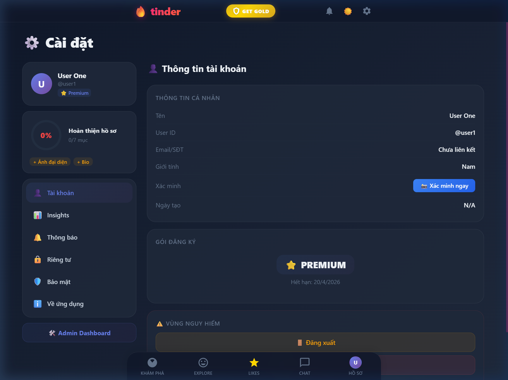
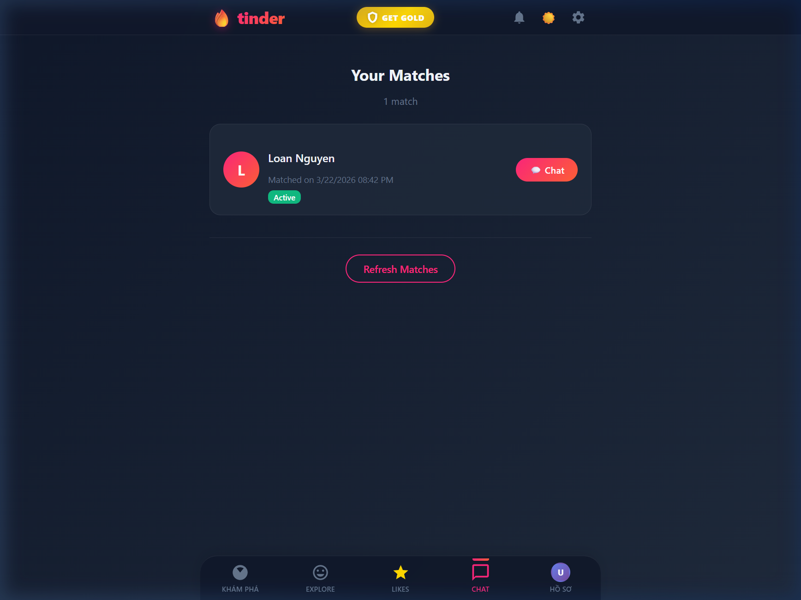
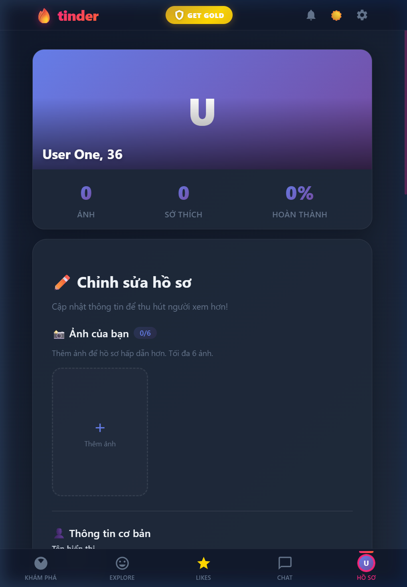

<div align="center">

# 🔥 Dating App — Tinder Clone

### A Full-Stack Real-Time Dating Application

[](https://nodejs.org/)
[](https://reactjs.org/)
[](https://www.mongodb.com/)
[](https://socket.io/)
[](https://www.docker.com/)

**A feature-rich, production-ready dating application built with modern web technologies.**  
**26+ features** | **Real-time Chat** | **AI Matching** | **Premium Tiers** | **Admin Dashboard**

[Demo](#screenshots) · [Features](#-features) · [Quick Start](#-quick-start) · [API Docs](#-api-documentation) · [Architecture](#-architecture)

</div>

---

## 📸 Screenshots

<div align="center">

| Settings | Matches | Profile |
|----------|---------|---------|
|  |  |  |

</div>

---

## ✨ Features

### Core
| Feature | Description | Status |
|---------|-------------|--------|
| 💫 **Swipe** | Like, Pass, Super Like with drag gesture | ✅ |
| ⏪ **Rewind** | Undo last swipe (limited per tier) | ✅ |
| 💕 **Matching** | Automatic match detection + animated notification | ✅ |
| 💬 **Real-time Chat** | Text, emoji, images, typing indicator, read receipts | ✅ |
| 📖 **Stories** | 24h stories with views, likes, progress bar | ✅ |
| 👀 **Who Liked You** | See who swiped right on you (Premium) | ✅ |

### Profile & Discovery
| Feature | Description | Status |
|---------|-------------|--------|
| 👤 **Rich Profiles** | Photos (6), bio, interests, details, zodiac | ✅ |
| 🎵 **Music Integration** | Anthem, top artists, genre (Spotify-style) | ✅ |
| 📍 **GPS Location** | Auto-detect location + distance display | ✅ |
| 🔍 **Smart Filters** | Age, gender, distance preferences | ✅ |
| 🤖 **AI Smart Match** | Compatibility score based on interests | ✅ |
| 💡 **Icebreakers** | AI-generated conversation starters | ✅ |

### Premium & Monetization
| Feature | Description | Status |
|---------|-------------|--------|
| 💎 **Premium/Gold Tiers** | Subscription with tier-based features | ✅ |
| ⚡ **Profile Boost** | 30-min visibility boost | ✅ |
| 🎁 **Virtual Gifts** | Send gifts in chat (roses, diamonds, etc.) | ✅ |
| 💳 **QR Payment** | MoMo/ZaloPay QR code payment | ✅ |

### Security & Admin
| Feature | Description | Status |
|---------|-------------|--------|
| 🔐 **JWT Auth** | Token-based auth + token versioning | ✅ |
| 🛡️ **Security Middleware** | XSS, NoSQL injection, CORS, rate limit | ✅ |
| 🔒 **Brute Force Protection** | Account lockout after 5 failed attempts | ✅ |
| ✅ **Selfie Verification** | Photo verification with admin review | ✅ |
| 🚫 **Block & Report** | Block users, submit reports | ✅ |
| 📊 **Admin Dashboard** | Users, reports, verifications management | ✅ |

---

## 🛠️ Tech Stack

```
Frontend          Backend           Database         DevOps
─────────         ──────────        ──────────       ──────────
React 18          Node.js 18        MongoDB 7        Docker
React Router      Express.js        Mongoose         Nginx
CSS3 / Animations Socket.io         GridFS (files)   Docker Compose
Context API       JWT (jsonwebtoken)                  ESLint + Prettier
                  bcrypt.js                           Swagger (API Docs)
                  Helmet.js
```

---

## 🚀 Quick Start

### Prerequisites
- **Node.js** 18+
- **MongoDB** 7+ (or Docker)
- **npm** 9+

### Option 1: Local Development

```bash
# 1. Clone
git clone https://github.com/your-username/dating-app.git
cd dating-app

# 2. Backend
cd backend
cp .env.example .env          # Configure your environment
npm install
npm run dev                    # Starts on http://localhost:5000

# 3. Frontend (new terminal)
cd frontend
npm install
npm start                      # Starts on http://localhost:3000

# 4. Seed sample data (optional)
cd backend
node seed-users.js
```

### Option 2: Docker (Recommended)

```bash
# One command to run everything
docker-compose up --build

# App available at:
# Frontend: http://localhost
# Backend:  http://localhost:5000
# API Docs: http://localhost:5000/api-docs
```

---

## 📚 API Documentation

Interactive API documentation available at:

```
http://localhost:5000/api-docs
```

### Key Endpoints

| Method | Endpoint | Description |
|--------|----------|-------------|
| `POST` | `/api/auth/register` | Register new account |
| `POST` | `/api/auth/login` | Login (JWT token) |
| `GET` | `/api/users/available/:userId` | Get swipeable users |
| `POST` | `/api/swipes` | Create swipe action |
| `POST` | `/api/swipes/rewind` | Undo last swipe |
| `GET` | `/api/matches/:userId` | Get user's matches |
| `GET` | `/api/messages/:matchId` | Get chat messages |
| `POST` | `/api/messages` | Send message |
| `POST` | `/api/stories` | Create a story |
| `POST` | `/api/boost/activate` | Activate profile boost |
| `POST` | `/api/reports` | Report a user |
| `GET` | `/api/admin/stats` | Admin statistics |

---

## 🏗️ Architecture

```
dating-app/
├── 📁 backend/
│   ├── 📁 config/         # Database, Swagger config
│   ├── 📁 middleware/     # Auth, Security, Sanitize, Error handling
│   ├── 📁 models/         # Mongoose schemas (9 models)
│   ├── 📁 routes/         # API endpoints (18 route files)
│   ├── 📁 utils/          # Socket utilities
│   ├── 📁 tests/          # Unit & integration tests
│   ├── 📄 index.js        # Server entry point
│   └── 📄 Dockerfile
├── 📁 frontend/
│   ├── 📁 src/
│   │   ├── 📁 components/ # React components (25+)
│   │   ├── 📁 context/    # Auth, Socket contexts
│   │   ├── 📁 services/   # API service layer
│   │   └── 📄 App.js      # Main app with routing
│   ├── 📄 Dockerfile
│   └── 📄 nginx.conf
├── 📄 docker-compose.yml
├── 📄 .prettierrc
└── 📄 README.md
```

### Data Flow

```
User Action → React Component → API Service → Express Route → MongoDB
                                      ↕
                               Socket.io (Real-time)
                                      ↕
                              Other Connected Clients
```

---

## 🔐 Security

| Layer | Protection |
|-------|-----------|
| **Transport** | CORS whitelist, Security Headers (OWASP) |
| **Authentication** | JWT with token versioning, bcrypt (cost 12) |
| **Input** | XSS sanitization, NoSQL injection prevention, prototype pollution guard |
| **Rate Limiting** | Global (500/15min), Auth (10/min), Brute force lockout (5 attempts) |
| **Files** | Type validation, size limits (10MB), directory listing disabled |

---

## 🧪 Testing

```bash
# Run backend tests
cd backend
npm test

# Run frontend tests
cd frontend
npm test
```

**10 backend test suites** covering:
- Database connectivity
- User availability logic
- Match detection & creation
- Swipe edge cases
- Socket.io integration
- Server health

---

## 📦 Deployment

### Docker Production

```bash
# Build and run
docker-compose -f docker-compose.yml up -d --build

# Scale backend
docker-compose up -d --scale backend=3
```

### Environment Variables

See [`backend/.env.example`](backend/.env.example) for all configuration options.

---

## 📊 Project Stats

| Metric | Count |
|--------|-------|
| React Components | 25+ |
| API Routes | 18 files |
| Database Models | 9 |
| Test Suites | 13 |
| Security Middleware | 4 layers |
| Total Features | 26+ |
| Lines of Code | ~15,000+ |

---

## 🤝 Contributing

1. Fork the repository
2. Create your feature branch (`git checkout -b feature/amazing-feature`)
3. Commit your changes (`git commit -m 'Add amazing feature'`)
4. Push to the branch (`git push origin feature/amazing-feature`)
5. Open a Pull Request

---

## 📄 License

This project is licensed under the MIT License.

---

<div align="center">

**Built with ❤️ and ☕**

⭐ Star this repo if you found it helpful!

</div>